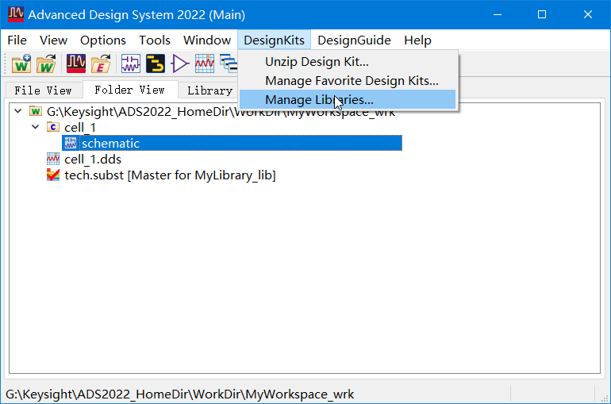
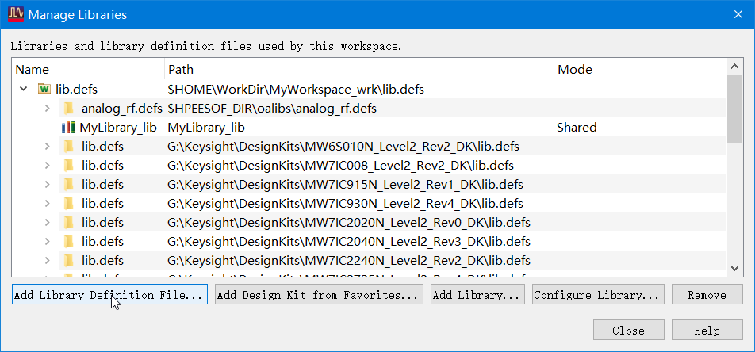
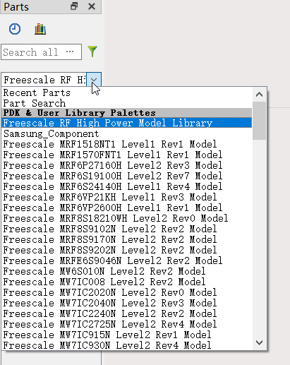
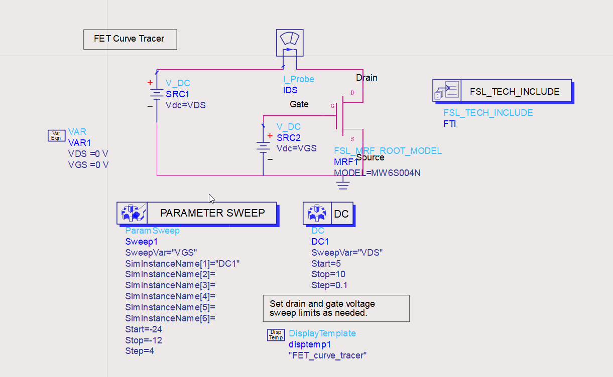
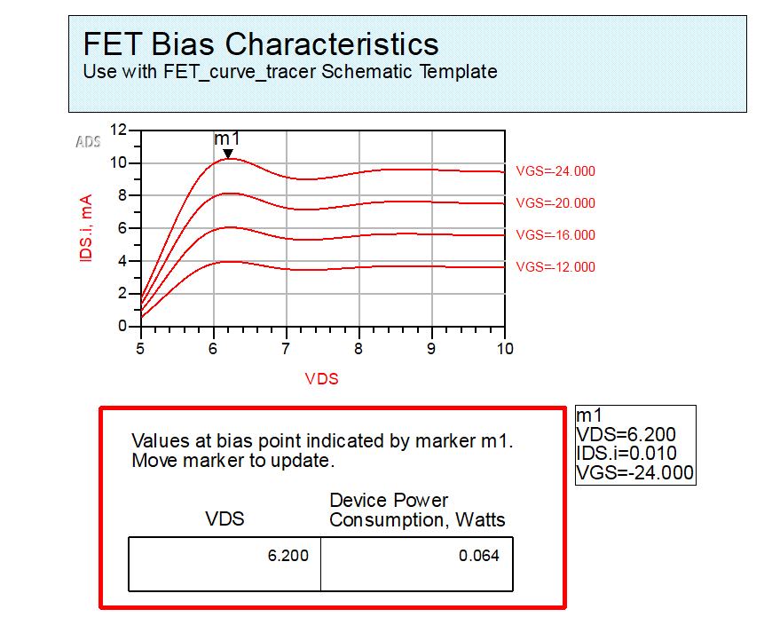
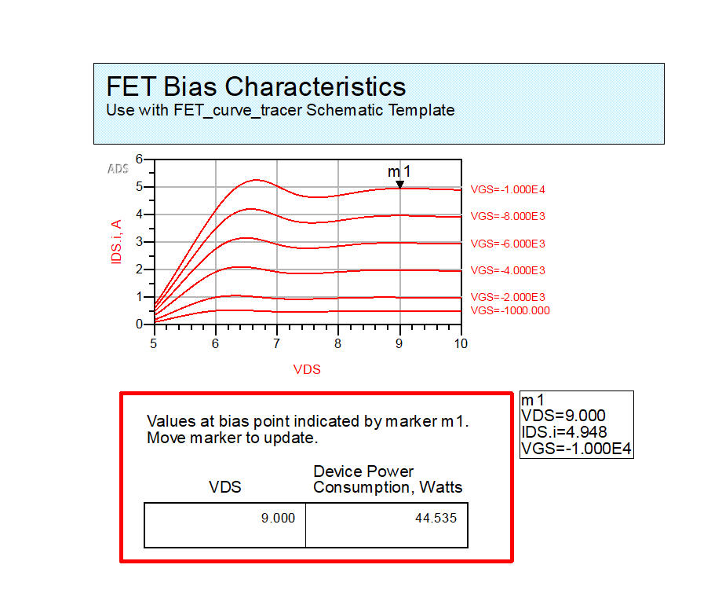

# 20220715-每日汇报

## 今日学习内容

结合近几天的预习成果，深入研究低噪声放大器仿真中的各个环节。

今日的主要研究点集中在测试直流工作点所用的“直流偏置参数扫描”功能，

并讨论一个仿真中遇到的问题。

## 仿真实验流程

### 导入模型

本次仿真实验使用了一支飞思卡尔（Freescale）提供的 MOSFET 射频大功率晶体管模型。

导入模型：

选中已经事先从网上下载并解压好的飞思卡尔元件库的 `lib.def` 文件，完成元件库的导入。

新建工作区，新建 Schematic 文件并打开。

此时可从图纸区左侧的 Parts 菜单中找到刚刚导入的元件库：

在里面找到本次仿真使用的 MOSFET 管子模型，放入图纸即可使用。

### 直流偏置扫描

`顶部菜单 - Insert - Template...`

插入模板，选择 `FET_curve_tracer` 模板放置在图纸上。

正确连接其引脚；再将其参数模块放入图纸。

按 F7 运行仿真，ADS 会提示“没有标注待测电压节点的名字”，

由于我们并不需要测量其他的节点电压，选择 Run Anyway 即可。

输出结果：

此时已经完成了直流偏置扫描。

拖动图上的 m1 游标，可以从下方表格中查到在图标所指图线所对应的$V_{GS}$条件下，

当前$V_{DS}$所对应的器件消耗功率。

### 评估仿真结果

显然，这只管子的增益随$V_{DS}$的变化而波动，其特性曲线与理想 MOSFET 模型的平坦曲线并不相同。

在 8.4V 之前，管子对$V_{DS}$的变化较为敏感。

## 讨论：元件模型是否有击穿电压或功率

没有找到这支管子的 Datasheet，但仍然希望通过仿真实验了解这支管子的击穿电压或击穿功率。

设置一个不合理的$V_{GS}$大数值 10000.0V：

但从图上可见，ADS 认为此时管子仍在工作，其特性曲线仍然和正常数值类似，

只是$I_{DS}$和输出功率的数量级相应提高而已。

据此推断，器件厂商提供的元件模型不会考虑击穿的情况，也不包含击穿电压或击穿功率；

因此，不能在没有查阅器件的 Datasheet 的情况下，仅从 ADS 的仿真结果判断器件是否可以在给定的工作点处安全工作。

## 明日学习计划

继续深入研究低噪声放大器仿真中的各个环节，

将研究重点转移到“散射参量的参数扫描”环节。
