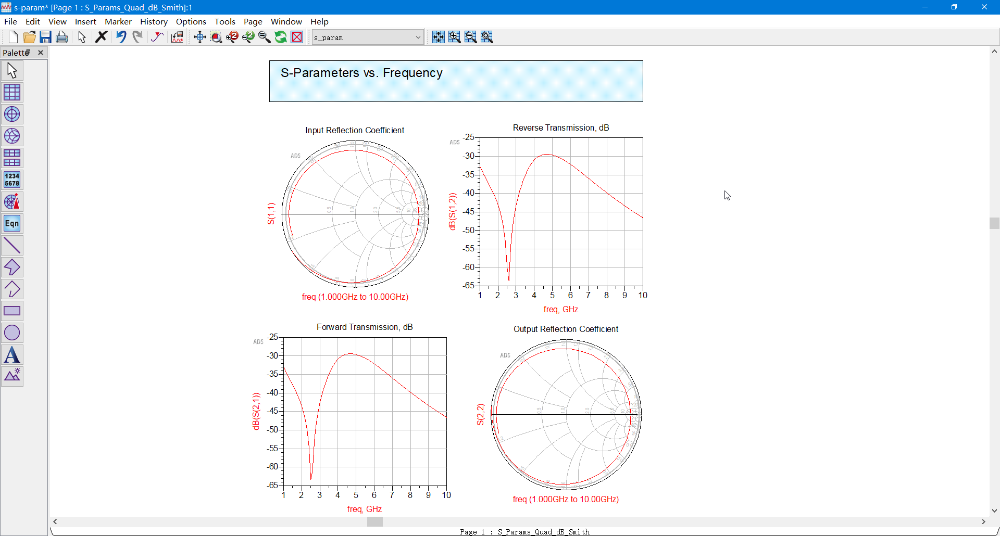

# 20220718-每日汇报

## 今日学习内容

结合近几天的预习成果，深入研究低噪声放大器仿真中的各个环节。

今日的主要研究点集中在测试直流工作点所用的“散射参量的参数扫描”功能。

## 仿真实验流程

继续使用昨天仿真实验使用的飞思卡尔 MOSFET 器件模型。

在图纸区放入 `S-PARAMETERS` 参数扫描模板，将晶体管器件接入模板电路：

在下方的 `Start`, `Stop`, `Step` 处设置起始频点、终止频点和频率步长，按 F7 运行仿真。

仿真结果如图所示。

## 评估仿真实验结果

结合之前自学的理论知识，我们知道，

作为放大器使用时，$|S_{21}|^2$表征最大转换功率$G_T$。

同时，我们希望晶体管的$S_{12}$较小些。

但从仿真结果给出的这两个参量随频率的变化曲线可见，它们同步取到最小值。

我们在$S_{12}$图表上放置最小值探针 m1：

再在$S_{21}$图表上放置最小值探针 m2：

显然可见，在不外接匹配网络的情况下，$S_{12}$和$S_{21}$的优化指标不能同时满足。

从散射参量扫描给出的史密斯圆图来看，该器件在圆图上的轨迹总偏离归一化阻抗匹配点，即圆图圆心，是明显不匹配的。

之后需要为其设计匹配网络，矫正其匹配情况。

## 明日学习计划

继续深入研究低噪声放大器仿真中的各个环节，

将研究重点转移到“阻抗匹配网络的设计”环节。
