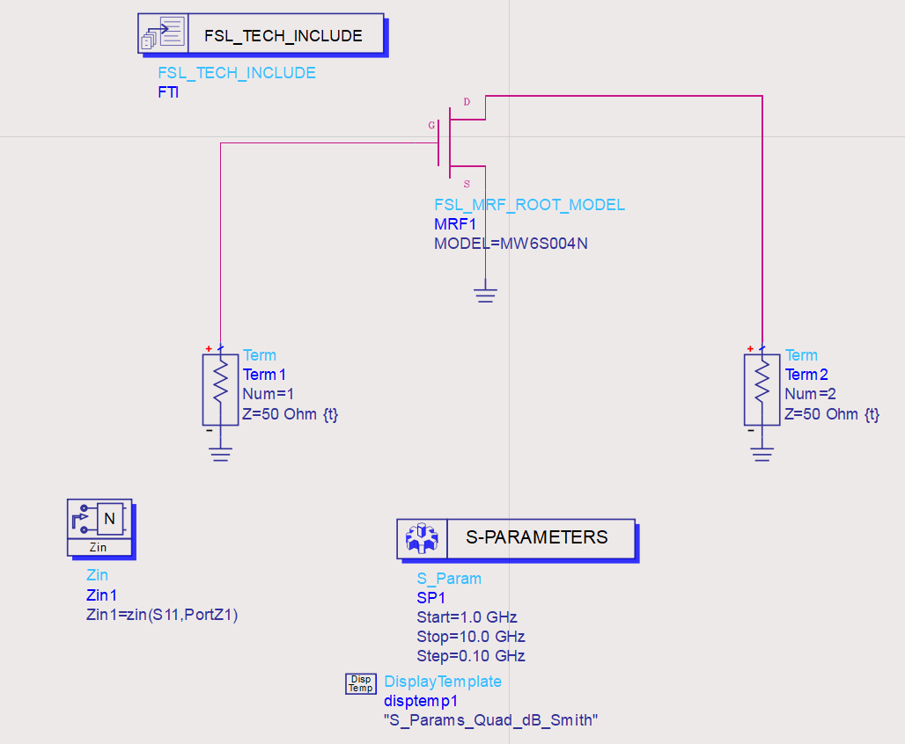
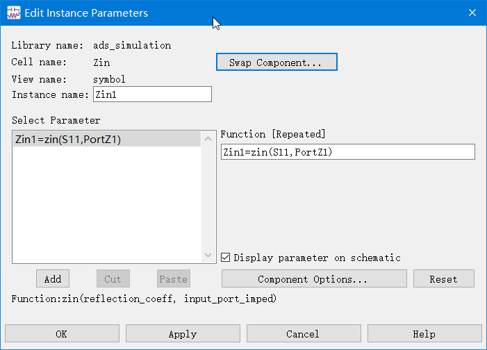
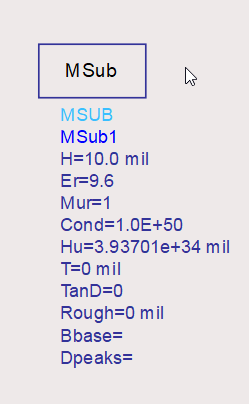
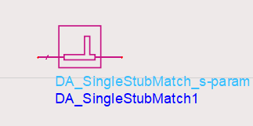
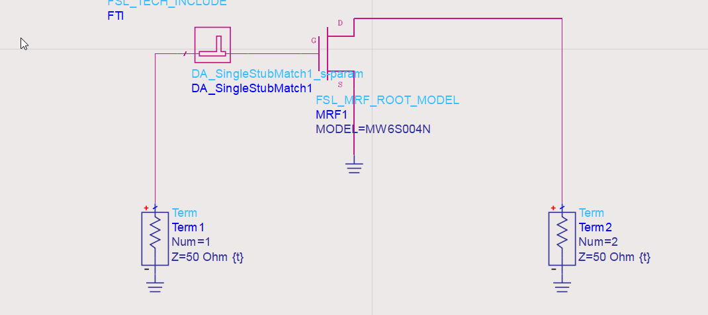
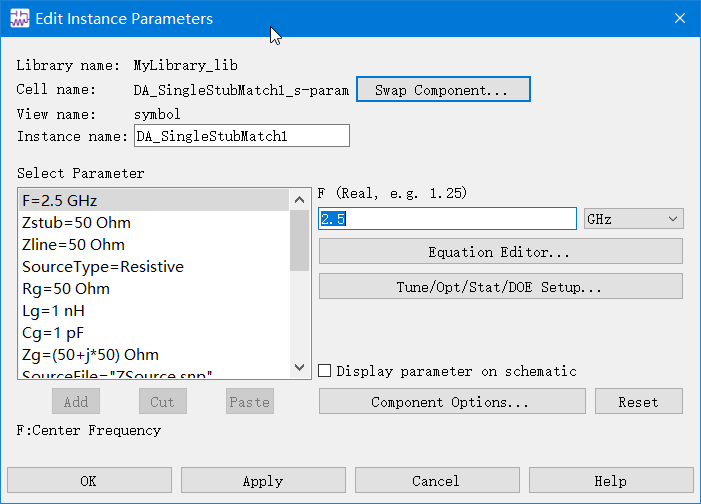
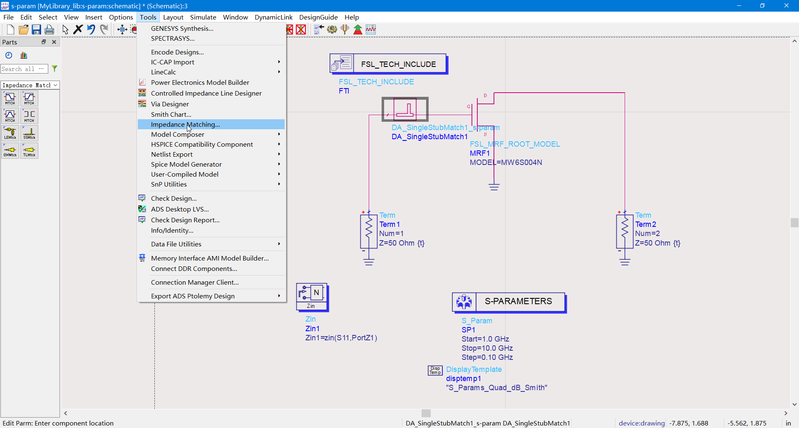
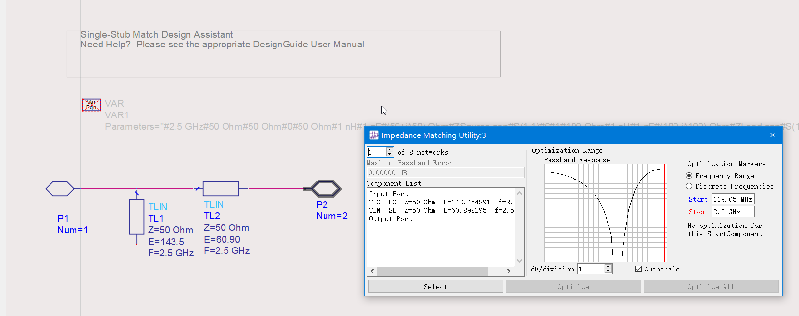

# 20220719-每日汇报

## 今日学习内容

结合近几天的预习成果，深入研究低噪声放大器仿真中的各个环节。

今日的主要研究点集中在测试直流工作点所用的“阻抗匹配网络的设计”功能。

## 仿真实验流程

继续使用昨天仿真实验使用的飞思卡尔 MOSFET 器件模型和参数扫描电路模板。

在图纸区放入 `Zin` 模板，增加阻抗显示功能：

检查该模块的参数

运行仿真，得到输入阻抗随频率的变化表，

由表可知，其匹配结果并不理想，偏离我们希望的值$50\Omega$。

选择微带线，调整 `MSub` 中微带线的参数：

选择并联单支节匹配器，

接入电路，如图所示：

设置其工作频点，设置匹配网络的目标输入阻抗为晶体管的输出阻抗，设置匹配网络的负载阻抗。

选择 `Impedence Matching... `

运行此功能，即得到匹配电路。

## 明日学习计划

结合之前学习的理论知识，分析阻抗匹配的输出图表，

评价阻抗匹配结果的好坏，并总结整个低噪声放大器设计实验，

为“高增益放大器的仿真设计”实验做准备。
