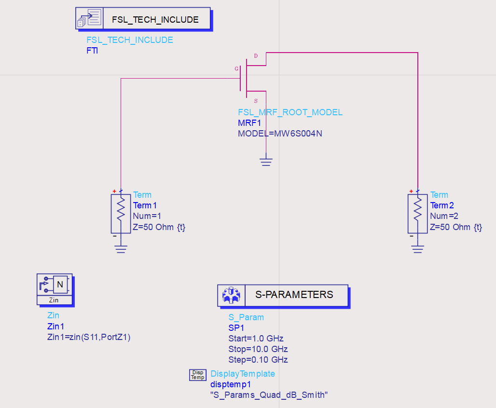

# 20220720-每日汇报

## 今日学习内容

- 结合之前学习的理论知识，分析阻抗匹配的输出图表，评价阻抗匹配结果的好坏
- 总结整个低噪声放大器设计实验

## 仿真实验流程

### 测量输入阻抗

继续使用昨天仿真实验使用的飞思卡尔 MOSFET 器件模型和参数扫描电路模板。

在图纸区放入 `Zin` 模块

按 `F7` 运行仿真，仿真结果默认为散射参量扫描图，不会立即显示输入阻抗图。

在图标区左边选择 List，插入一张列表：

在弹出的窗口中，将 `Zin1` 添加到右边的 Trace 窗格：

之前自学的过程中，我们发现旧版本的 ADS 需要对复阻抗作换算处理，

从 `幅度/相位` 格式换算为 `实部+虚部i` 格式为了避免换算，我们使用 ADS 内置的变量格式转换功能。

点击右边窗格上方的 `Trace Options...` 呼出数据格式选项，在下方下拉菜单选择 `Real/Imaginary`

ADS 就会列出扫频范围内各频点与输入阻抗 `Zin1` 的数值关系表。

若选定工作频点为 2.5GHz，则查此表得工作频点处的输入阻抗为$1.440 + j14.011$。

### 匹配网络设计

在图纸区左边的工具箱搜索 ADS 内置的微带线电路智能元件库 `Passive Circuit DG - Microstrip Circuits`，

在里面找到单枝节匹配器，放入电路，设置其工作参数：

工作频点设为 2.5GHz，负载阻抗设为刚才测得的放大器输入阻抗 `1.440 + j*14.011`。

选择顶部菜单栏 `DesignGuide`，找到 `Passive Circuit`：

打开，选择第一个选项 `Passive Circuit Control Window`。

在弹出窗口中选择 `Design Assistant` 选项卡，点击 `Design` 按钮，等待进度条到达 100%，设计完成。

然后回到图纸区顶部菜单栏，选择 `Push into Hierarchy`

ADS 就会显示综合完成的匹配网络。

按照相同的步骤，作输出阻抗的匹配。

输出阻抗匹配网络：

### 绘制图表，评估仿真结果

散射参量与频率的关系图：直接添加 4 个 Rectangular Plot，

在每个图中分别将其中一个散射参量，如 `S(1,1)`，加入到右侧 Trace 窗格即可。

稳定系数图表：需放入 StabFact 控件，然后仿真，添加 Rectangular Plot，将 StabFact 加入右侧 Trace 窗格即可。

噪声系数图表：双击 `S_PARAMETER` 控件，在弹出窗口的 `Noise` 选项卡中，将 Calculate Noise 打勾，

然后仿真，添加 Rectangular Plot，将 `nf(2)` 加入右侧 Trace 窗格即可。

仿真结果如图。

从仿真结果图中可以看出，虽然 `S(1,1)`  和 `S(2,2)` 性能优良，在工作频点处均小于 -15dB，

有效减少了反射损耗，可见匹配效果较好；

但噪声系数的数值过大，可能应当考虑更改工作频点，或更换其他种类/厂商的 MOSFET 器件等。

## 明日学习计划

学习相关理论知识，并深入探究“高增益放大器的仿真设计”实验。
