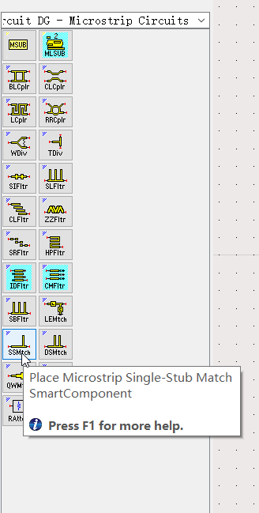
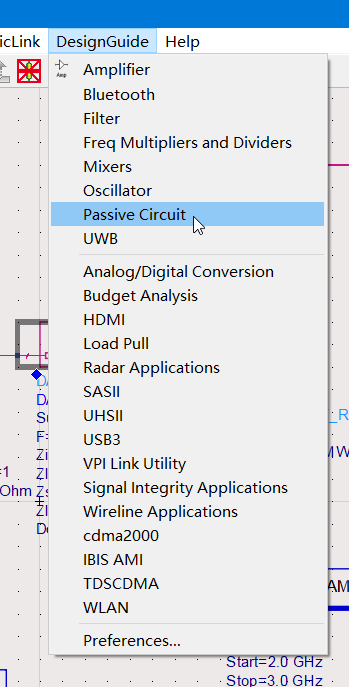
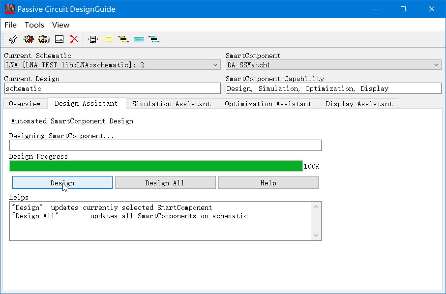
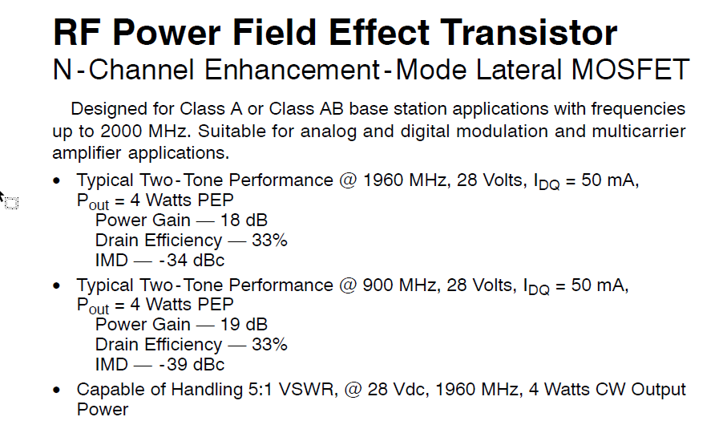
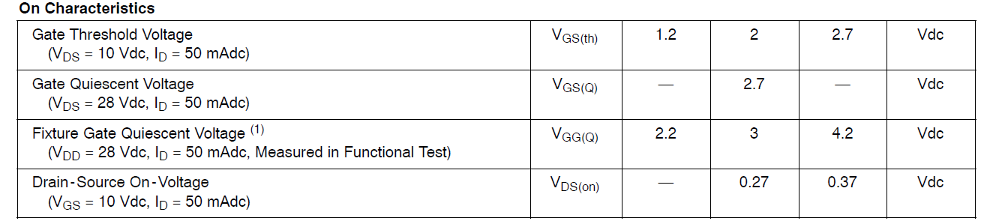
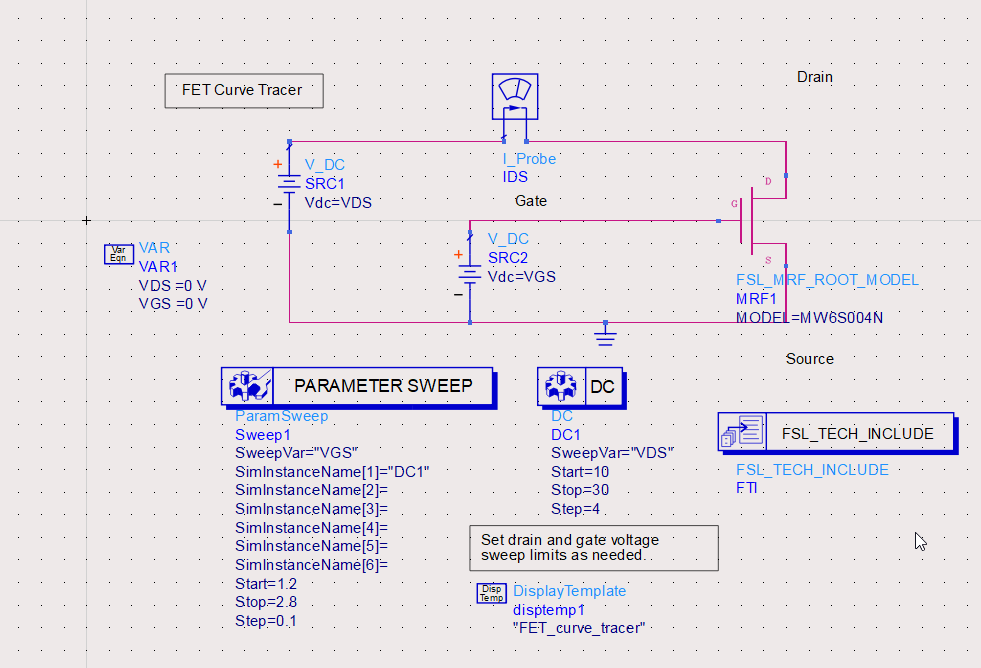
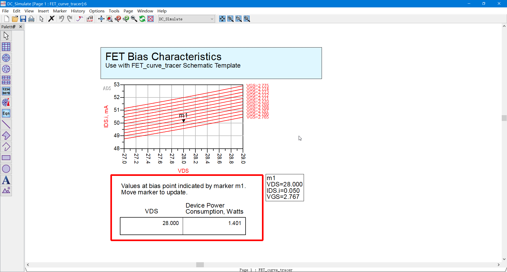

# 20220721-每日汇报

## 今日学习内容

- 总结整个“低噪声放大器设计”实验
- 深入探究“高增益放大器的设计”实验的各个环节，
  今日研究重点为结合器件 Datasheet 寻找直流工作点。

## 总结“低噪声放大器设计”实验

### 管子自身特性的检测

1. 测量直流工作点
   - 使用模板：`FET_curve_tracer`
   - 操作要点：设置好起止电压和步长，在输出的管子伏安曲线图上用 m1 游标寻找合适的工作点
2. 散射参量扫描
   - 使用模板：`S_Parameters`
   - 操作要点：注意观察 ADS 输出的散射参量 - 频率曲线和史密斯圆图，判断阻抗匹配好坏

### 设计匹配网络

3. 测量输入 / 输出阻抗
   - 使用模板：沿用散射参量扫描电路
   - 操作要点：放入 `Zin` 模块后，ADS 不会马上输出 `Zin` 图表。
     必须在仿真结果图中插入一张显示 `Zin` 参量的 List，
     
     此时可以选择其显示格式为“实部 + j*虚部”（ADS 显示为 `Real/Imaginary`）

     若测量输入阻抗，需设置 `Zin1=zin(S11,PortZ1)`；测量输出阻抗则需设置 `Zin1=zin(S22,PortZ2)`
4. 阻抗匹配
   - 在信源端口与晶体管之间插入智能单枝节匹配器组件 `DA_SSMatch_LNA`。
     
     该元件在 `Passive Circuit DG - Microstrip Circuits` 分类下可以找到，也可以直接在工具箱搜索框中搜索。

     
   - 设置该组件的几个主要参数：
     - `MSub` 模块：该模块带有微带线器件的参数，必须放入原理图中，根据设计要求调整其参数
     - `F`：工作频点
     - `Zin`：匹配器输入阻抗，此时是$50\Omega$。若是匹配输出阻抗，应将其设置为晶体管输出阻抗的测量值。
     - `Zload`：匹配器输出阻抗，此时是晶体管输入阻抗的测量值。若是匹配输出阻抗，应将其设置为$50\Omega$。
    - 设置完毕后，顶部菜单 `Design Guide` - `Passive Circuit`
      
      

      选择 `Design Assistant` 选项卡，点击 `Design` 等待进度条到达 100%

      

### 评估仿真结果

在原理图中放置 `StabFact`，

双击 `S_PARAMETER` 控件，在弹出窗口的 `Noise` 选项卡中，将 Calculate Noise 打勾；

在仿真结果中添加 `StabFact` 和 `nf(2)` 的图表。

至此低噪声放大器设计实验全部完成，可以依据仿真结果中的图表对设计结果做评估了。

## 高增益放大器设计实验

今日学习的重点放在结合 Datasheet ，深入探究高增益放大器设计实验的“直流工作点扫描”部分。

### 阅读 Datasheet

由元件库标识的元件型号 `MW6S004N`，在网上找到了由 NXP （恩智浦）公司提供的元件的 Datasheet：

该 MOSFET 为 N 沟道增强型，有两个典型工作频率：900MHz 和 1.96GHz，其典型直流偏置均为 28Vdc，

而按照 Datasheet 下文所述，直流偏置为 10V 时，其栅极开启电压在 1.2V - 2.7V 之间，典型值为 2V。

我们用 ADS 进行仿真，

从参数扫描结果显而易见，栅压加到 2.3V 时，该晶体管仍处于未开启状态。

由 Datasheet 可见，典型工作状态下该管子的漏极电流应为 $I_{DQ}=50{\rm A}$，

将参数扫描范围缩小，$V_{GS}$选在 2.765 - 2.775V 之间，直流偏置选在 27-29V 之间。

据此可知，若要将一交流小信号灌入此晶体管栅极使其放大，应将其直流偏置到 2.77V，

若其峰峰值不大于 10mV，可确保其放大是线性的。

据此，我们选定其直流工作点为$$V_{DS}=27.5{\rm Vdc}, V_{GS}=2.77{\rm V}$$

## 明日学习计划

学习相关理论知识，并进一步深入探究“高增益放大器的仿真设计”实验。

明日研究重点为“偏置电路的设计”。
