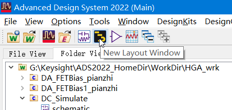
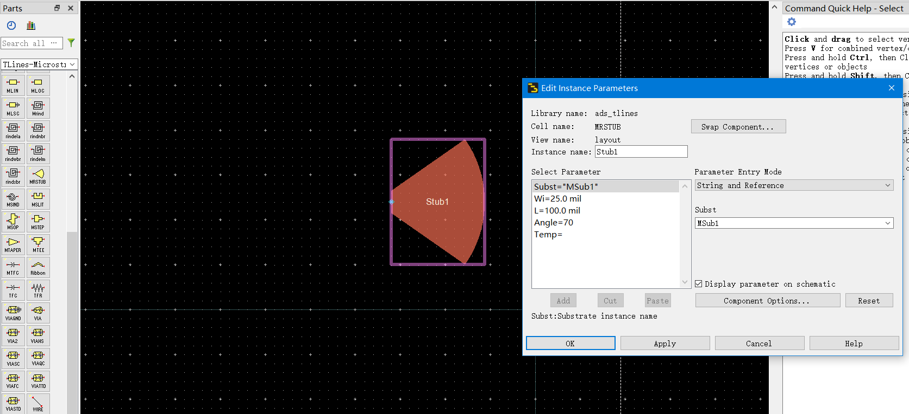

# 20220722-每日汇报

## 今日学习内容

深入探究“高增益放大器的设计”实验的各个环节，

今日研究重点为直流偏置电路的设计。

## 电路版图的绘制

新建一张版图（Layout）：

打开版图，从左侧元件箱中选择需要的微带元件放入版图图纸区，

双击微带元件可以设置其参数。

不同的元件可以设置的参数不同。图中展示的扇形短路块具有 `Wi`，`L`，`Angle` 三个参数。

此外还有微带线本身的参数集 `MSub` 需要依据具体的仿真要求而设置。

### 原理图的绘制

偏置电路的原理图是在 Schematic 中绘制的，

其绘制方法与之前使用模板电路仿真的方法一致，

只需将器件放入图纸区并连接即可。

在绘制完毕后，需要将偏置电路作相应封装，作为模块，

以便于之后在原理图中组成整个系统。

## 明日学习计划

- 查阅有关资料，了解如何使用 ADS 的微带线偏置电路设计工具，
  借助 ADS 自动仿真设计晶体管偏置电路。
- 对偏置电路设计的有关理论知识补缺补漏。
